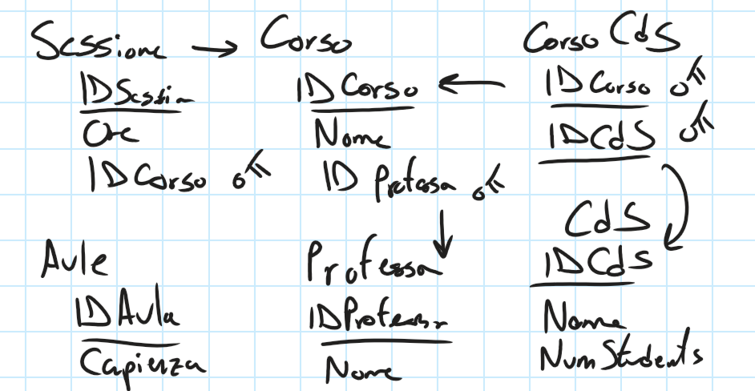

# Abstract: A SAT-Solver Project
This is a project done for the course in *Computability, Complexity and Logic* (A. Peron, 2024-2025). The goal of this course is to design a Python module which, given sufficient information about the courses, classes, lectures, professors and rooms, is able to create a time table for the given courses. 

In particular, it will use the SAT-solver Z3 and a well-defined logic formulation of the problem to create such schedule, which will be seen in the next paragraphs. 

> *NOTE: The problem modelling and the logic formulation are done in Italian.*

*Questo è un progetto svolto per il corso di Calcolabilità, Complessità e Logica (A. Peron, 2024-2025). L’obiettivo del corso è progettare un modulo Python che, date informazioni sufficienti su corsi, classi, lezioni, docenti e aule, sia in grado di creare un orario per i corsi indicati.*

*In particolare, verranno utilizzati il SAT-solver Z3 e una formulazione logica ben definita del problema per generare tale pianificazione. Vedremo tale formulazione logica del problema nelle prossime sezioni.*

---

# Modellizzazione e Formulazione del Problema

## Step 1 — Modellizzazione del problema

- **Ogni corso** è associato ad **una o più sessioni**, con una lunghezza determinata a priori.  
  *Esempio*: Analisi 1 ha 6 ore settimanali totali, quindi potrebbe essere suddivisa in 3 sessioni da 2 ore ciascuna.

- **Ogni Corso di Studio (CdS)** è associato ad uno o più corsi (e viceversa).  
  Inoltre, per ogni CdS conosciamo una stima degli studenti che lo frequentano.

- **Ad ogni corso è univocamente assegnato un professore.**

- **Ci sono anche le aule**; per ognuna si indica la capienza massima di studenti.

Si da una rappresentazione della modellizzazione del problema con lo schema relazionale sottostante.

## Step 2 — Formulazione logica

**Notazione**

- Sessioni enumerate: $S_1, \ldots, S_{n_S} \in \mathcal{S}$
- Timeslot enumerati: $T_1, \ldots, T_{m_T} \in \mathcal{T}$
- Aule enumerate: $A_1, \ldots, A_{n_A} \in \mathcal{A}$

(Analogamente per professori, corsi e CdS.)

**Funzioni/mappature**

- Sessione → Corso:  \\
  $$G : \mathcal{S} \rightarrow \mathcal{C}$$

- Corso → Professore:  \\
  $$P : \mathcal{C} \rightarrow \mathcal{P}$$

- Sessione → Altre sessioni degli altri corsi che appartengono allo stesso CdS (escludendo sé stessa, fornite in input):  \\
  $$\Delta : \mathcal{S} \rightarrow \mathcal{P}(\mathcal{S}) \subseteq \mathcal{S}$$

- Sessione → Ore:  \\
  $$H : \mathcal{S} \rightarrow \mathbb{N}^\*$$

- Sessione → # studenti che la frequentano:  \\
  $$N : \mathcal{S} \rightarrow \mathbb{N}^\*$$

- Aula → Capienza:  \\
  $$K : \mathcal{A} \rightarrow \mathbb{N}^\*$$

**Variabili decisionali**

- $$X_{S,T,A}$$: dato $S \in \mathcal{S}, T \in \mathcal{T}, A \in \mathcal{A}$, indica se inserisco la sessione $S$ nello slot $T$ in aula $A$ (booleano).

- $$Y_{S,T,A}$$: come prima, indica se la sessione $S$ in aula $A$ **inizia** nello slot $T$ (booleano).

**Vincoli**

**C1 — Un solo evento per aula e slot**  \\
Nello stesso slot e nella stessa aula ci può essere una sola sessione:

$$
\forall S,T,A \quad X_{S,T,A} \Rightarrow \bigwedge_{\substack{S' \neq S \\ S' \in \mathcal{S}}} \neg X_{S',T,A}
$$

**C2 — Sessioni contigue (no “buchi” o cambi di giorno)**  \\
Le sessioni vanno piazzate in maniera contigua, senza interruzioni tra giornate.  \\
(*Esempio*: una sessione da 3 ore deve iniziare e finire nello stesso giorno e le ore devono essere consecutive.)

Indicativamente (trascrizione della forma in nota):

$$
\forall S,T,A \; Y_{S,T,A} \Rightarrow
\begin{cases}
\neg Y_{S,T,A}, T + H(S) > T_{\max} & \text{(non si sfora la fine della giornata)} \\
\neg Y_{S,T,A}, \left\lfloor \dfrac{T + H(S)}{r} \right\rfloor \neq \left\lfloor \dfrac{T}{r} \right\rfloor & \text{(non si cambia giorno)} \\
\bigwedge_{h = 0}^{H(S)-1} X_{S,T+h,A}
\end{cases}
$$

**C3 — Un professore può insegnare solo un corso alla volta per slot**

$$
\forall S,T \quad \bigvee_{A} X_{S,T,A} \Rightarrow
\bigwedge_{\substack{S' \neq S \\ A'}} \neg X_{S',T,A'} \\
\text{s.t. } P(G(S)) = P(G(S'))
$$

**C4 — Nello stesso timeslot non possono esserci 2 sessioni di corsi appartenenti allo stesso CdS**

$$
\forall S,T \quad \bigvee_{A} X_{S,T,A} \Rightarrow
\bigwedge_{\substack{S' \in \Delta(S) \\ A' \in \mathcal{A}}} \neg X_{S',T,A'}
$$

**C5 — Le aule devono avere sufficiente capienza**

$$
\forall S,A \quad \bigvee_{T} X_{S,T,A} \Rightarrow \left( K(A) \ge N(C(S)) \right)
$$

**C6 — Ogni sessione è organizzata una sola volta**

$$
\forall S \quad \sum_{T,A} Y_{S,T,A} = 1
$$

**C7 — Una sessione è organizzata in una sola aula**

$$
\forall S,T,A \quad X_{S,T,A} \Rightarrow \bigwedge_{A' \ne A} \neg X_{S,T,A'}
$$

---

# Struttura del Repo

`sql_utilities.py`: Per implementare la modellizzazione del problema si userà un database in SQLite3. In questo file verranno forniti gli strumenti per interrogare il database. Le funzioni implementate in questo file sono fatti per fornire le informazioni al modello; tuttavia vi è la funzione `execute_query` generica che permette all'utente di interrogare il database arbitrariamente. Per creare il database contenenti i dati l'utente deve crearlo da solo mediante SQLite3 e porlo nella cartella `./databases/`. Come supporto alla creazione del database, è fornito uno script in `./fill_data/` per creare il database vuoto, e altri script come esempi per fornire i dati.

`model.py`: In questo modulo vi è la implementazione effettiva del modello e i vincoli essenziali. In particolare il risolutore verrà fornito come un oggetto Python, con i metodi `.start()`, `.add_constraints()` e `.solve()`. Per creare e usare un risolutore è sufficiente importare il modulo e creare un'istanza dell'oggetto `TimeTableScheduler(fname, timeslots_per_day)`, dove `fname` è il nome del database e `timeslots_per_day` è la quantità dei timeslot che si vuole dare per giorno.

`demo.ipynb`: Il notebook illustra i metodi con cui si può impiegare il modulo scritto in `model.py`. In particolare, nel notebook verranno trattati tre scenari:
1. Un esempio per mostrare la funzionalità del modello. Questo è uno scenario puramente fittizzio, creato ai fini di provare il modello.
2. I corsi universitari della triennale in AIDA del prossimo semestre
3. L'orario delle lezioni di un liceo linguistico, del triennio di una classe.

Notiamo che ad ogni scenario si può creare dei vincoli aggiuntivi come si desidera, per occuparsi di casi più specifici.